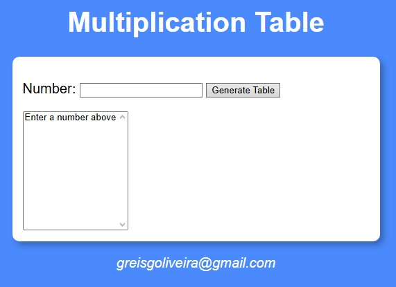
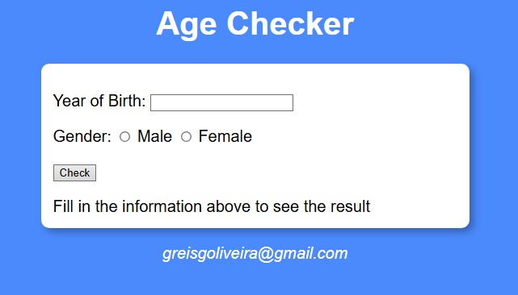
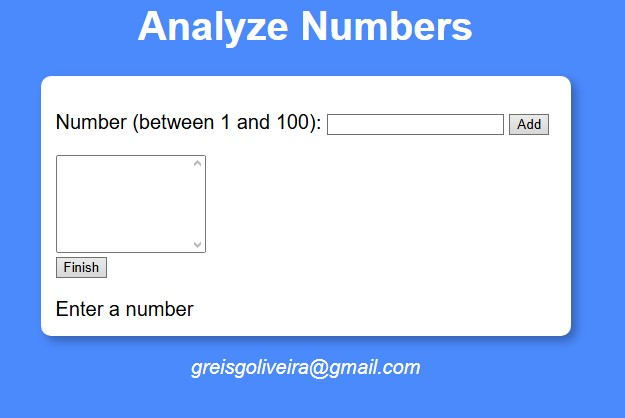
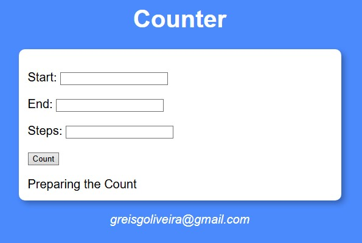
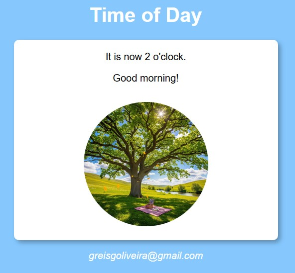

# Projetos de Prática com JavaScript 

Este repositório contém vários mini-projetos desenvolvidos com **HTML**, **CSS** e **JavaScript puro**.

Os projetos fazem parte da minha jornada de aprendizado em desenvolvimento front-end.

---

##  Projetos

| Nome                  | Descrição                                         | Visualizar (GitHub Pages)            |
|-----------------------|--------------------------------------------------|--------------------------------------|
| **Age**               | Verificador de idade com imagem dinâmica         | *(link em breve)*                    |
| **Analyzenumbers**    | Analisa números: total, maior, menor, média, soma| *(link em breve)*                    |
| **Counter**           | Contador simples com botões                      | *(link em breve)*                    |
| **Hours**             | Mostra a hora do dia e muda imagem e saudação    | *(link em breve)*                    |
| **MultiplicationTable** | Gera tabuada dinamicamente                    | *(link em breve)*                    |

---

## Prints

### Multiplication Table


---

### Age Checker


---

### Analyze Numbers


---

### Counter


---

### Time of Day (Hours)


---

## Como rodar localmente

Clone o repositório:

```bash
git clone https://github.com/GReisOliveira/testejs-projects.git
